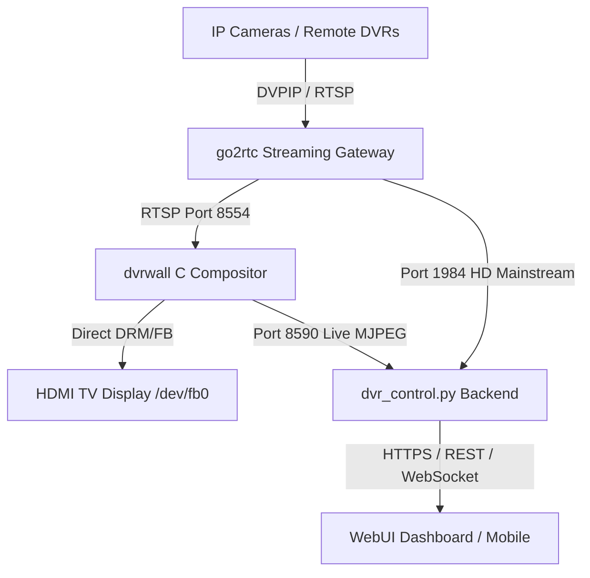

# 🎥 DVR Kiosk & Remote Wall Controller

[](LICENSE)
[]()
[]()

A high-performance, hardware-accelerated **Multi-DVR Kiosk & Web Controller** designed for Linux Single-Board Computers (Orange Pi, Raspberry Pi, Radxa, Banana Pi) and standard Linux servers.

Combines an ultra-efficient C-based HDMI video wall compositor (`dvrwall`) with a responsive, modern WebUI controller.

---

## 🌟 Key Features

- 🖥️ **Hardware-Accelerated 16-Tile Wall**: Custom NEON/libavcodec compositor rendering directly to `/dev/fb0` with bounded latency (sub-25ms).
- 🔍 **Dynamic 720p/1080p Mainstream Fullscreen**: 
  - **Grid Mode**: Low-bandwidth CIF substream (`subtype=1`).
  - **Fullscreen Mode**: Automatically switches to crystal-clear 720p/1080p HD mainstream (`subtype=0`) on both HDMI TV output and WebUI.
- ⚡ **Zero-Overhead Single-Decode Architecture**: Shares decoded memory buffers between the TV display and the WebUI, preventing redundant decoding and CPU strain.
- 🌐 **Multi-DVR & WAN Bandwidth Controls**: Dynamic ON/OFF toggles in WebUI to shut down idle remote DVR streams and conserve WAN data.
- 🎯 **Touch & Drag-and-Drop Layout Editor**: Interactive grid customization with custom channel labeling and persistent profiles.
- 🔒 **Hardened SBC Security**:
  - `fail2ban` brute-force protection with 24-hour ban.
  - Salted `bcrypt` password authentication and HTTPS TLS encryption.
  - Automatic security updates (`unattended-upgrades`).
- ⌨️ **Interactive CLI Tool (`dvr-kiosk`)**: Built-in terminal dashboard for password changes, service restarts, and configuration management.

---

## 🚀 Quick Install (1-Line Universal Installer)

Run this command on your Linux device (Orange Pi, Raspberry Pi, Debian, Ubuntu):

```bash
curl -fsSL https://raw.githubusercontent.com/tahashemi/DVR-kiosk/main/install.sh | sudo bash
```

### What the installer handles automatically:
1. Detects CPU architecture (`ARM64`, `ARMv7`, `x86_64`).
2. Installs FFmpeg development libraries, Python 3, and build essentials.
3. Compiles the high-speed `dvrwall` C compositor.
4. Sets up `go2rtc` and Python virtual environment.
5. Generates self-signed SSL certificates for HTTPS.
6. Installs and starts all systemd background services (`go2rtc.service`, `dvrwall.service`, `dvr-kiosk.service`).
7. Installs the interactive `dvr-kiosk` CLI command.

---

## 🗑️ Quick Uninstall (1-Line Complete Removal)

To completely remove DVR Kiosk, all systemd services (`dvr-kiosk`, `dvrwall`, `go2rtc`), binaries, and configurations:

```bash
curl -fsSL https://raw.githubusercontent.com/tahashemi/DVR-kiosk/main/uninstall.sh | sudo bash
```

---


## 💻 Interactive CLI Management

Simply type `dvr-kiosk` in your terminal to open the interactive management menu:

```bash
$ sudo dvr-kiosk
======================================================================
                  DVR KIOSK - SYSTEM MANAGEMENT MENU                  
======================================================================
  [1] Change Admin Password
  [2] View Service Status (dvr-kiosk, dvrwall, go2rtc, fail2ban)
  [3] Restart All Services
  [4] View Active DVRs & Channel Layout
  [5] Enable / Disable Remote DVR (Save WAN Bandwidth)
  [6] View Security & fail2ban Status
  [7] Create Emergency Backup & Rollback
  [0] Exit
======================================================================
```

---

## 🏗️ Architecture



---

## 📡 REST API Reference

| Endpoint | Method | Description |
| :--- | :--- | :--- |
| `/api/login` | `POST` | Authenticate user session with bcrypt |
| `/api/channels` | `GET` | Retrieve list of configured channels & labels |
| `/api/kiosk/grid` | `POST` | Switch hardware kiosk wall to multi-tile grid |
| `/api/kiosk/fullscreen` | `POST` | Switch kiosk & WebUI to 720p/1080p mainstream |
| `/api/dvr/toggle` | `POST` | Enable or disable a DVR to save WAN bandwidth |
| `/api/live/<dvr>/<ch>` | `GET` | Stream live hardware-decoded MJPEG video |
| `/api/stream/<dvr>/<ch>/main.jpg` | `GET` | Fetch 720p/1080p HD mainstream snapshot |

---

## 🛠️ Manual Installation & Development

```bash
# Clone the repository
git clone https://github.com/tahashemi/DVR-kiosk.git
cd DVR-kiosk

# Compile dvrwall compositor
make
sudo make install

# Install Python requirements
python3 -m venv venv
source venv/bin/activate
pip install -r requirements.txt

# Start backend controller
python3 src/dvr_control.py
```

---

## 📄 License

Distributed under the MIT License. See `LICENSE` for more information.
