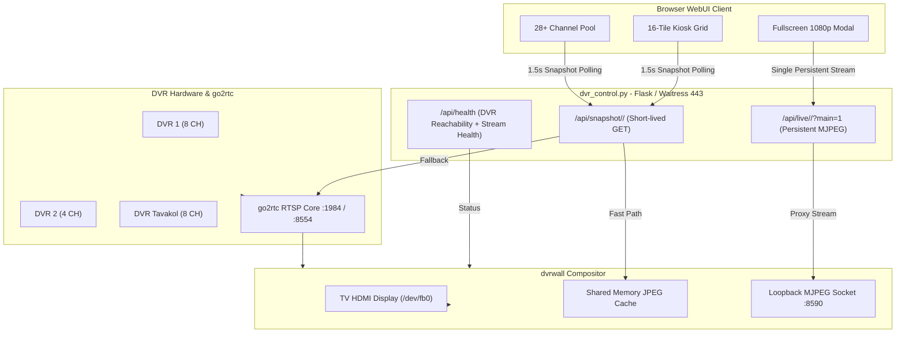

# Design Document: Hybrid Stream Engine, Fullscreen Transition, and Pool Status Fix

**Date:** 2026-08-17  
**Status:** Approved  
**Topic:** WebUI Grid & Pool Stream Engine, Smooth Fullscreen MJPEG Transition, and Accurate Multi-DVR Channel Status

---

## 1. Executive Summary

This design resolves three critical issues observed in the DVR Kiosk WebUI:
1. **Blank Channels in WebUI Grid**: Opening 16 simultaneous persistent MJPEG streams exceeded browser HTTP/1.1 per-host connection limits (max 6 sockets), leaving 10 tiles permanently blank and stalling all background API requests.
2. **Black Screen on Fullscreen Activation**: Entering WebUI fullscreen initiated an RTSP mainstream connection that took 3–6s to decode its first keyframe; during this startup window, `/api/live` returned 404/502 with no fallback, rendering a black screen.
3. **"0/8 Online" Pool Status Bug**: Channels not actively decoded in dvrwall's 16-channel TV roster were marked offline, causing DVR group headers in the pool to report "0/8 Online" and hiding reachable channels from the "Online" filter.

The solution implements a **High-Performance Hybrid Stream Engine**:
- **Grid & Pool**: 1.5s lightweight snapshot polling with in-place timestamp updates across all channels (28+ channels across all DVRs), eliminating socket exhaustion and DOM churn.
- **Fullscreen**: Dedicated persistent 1080p MJPEG stream with an instant 2-tier preview placeholder (<50ms paint) and seamless live stream upgrade.
- **Status & Roster**: DVR network reachability decoupled from dvrwall's on-screen decode roster, accurately reporting online camera counts and supporting on-demand stream demand.
- **Adaptive FPS & CPU Load Governor**: Maximizes framerate when system load is healthy (<80% CPU / load < 3.2), automatically throttling down refresh rates and compositor FPS if load exceeds 80% to prevent judder and thermal throttling.

---

## 2. Architecture & Components



---

## 3. Detailed Specifications

### 3.1 WebUI Grid & Channel Pool Stream Engine
- **Polling Cadence**: 1.5 seconds (`1500ms`), configurable via `THUMB_POLL_INTERVAL_MS`.
- **In-Place Image Updates**:
  - `refreshGridAndPoolThumbs()` loops through all `#kioskGrid img.live-thumb` and `#pool img.live-thumb`.
  - Updates `img.src = '/api/snapshot/' + dvr + '/' + ch + '?t=' + Date.now()`.
  - Does NOT call `innerHTML = ''` or recreate DOM elements; preserves Sortable drag-and-drop handles and event listeners.
- **Error Recovery**:
  - `img.onload` displays the image and hides error placeholders.
  - `img.onerror` falls back to placeholder icon without permanently breaking the tile or disabling subsequent polling ticks.

### 3.2 Fullscreen Transition & Mainstream Load-Shedding
- **2-Tier Instant-Paint**:
  1. Set `img.src = '/api/stream/' + dvr + '/' + ch + '/main.jpg?t=' + Date.now()` (or `/api/snapshot/...`) to display cached/substream frame instantly (<50ms).
  2. Create a background `Image` or connection loader for `/api/live/<dvr>/<ch>?main=1`.
  3. When the live MJPEG stream responds with HTTP 200 and begins streaming, smoothly swap `img.src` to the live MJPEG feed.
  4. If the live stream is not ready (HTTP 404/502 while mainstream connects), retry after 1.5s without blanking the existing still image.
- **Hardware Load Shedding**:
  - Triggering fullscreen invokes `/api/kiosk/fullscreen` (`launch_fullscreen`), commanding dvrwall to drop all 16 substreams and allocate decoding threads exclusively to the 1080p mainstream.
  - Exiting fullscreen (`closeWebFullscreen`) invokes `/api/kiosk/grid`, restoring the 16 substreams for the TV hardware display and resuming background WebUI polling.

### 3.3 Channel Status & Multi-DVR Reachability
- **Decoupled Status Evaluation**:
  - A channel's online status in `getTileStatus(dvr, ch)` is computed as:
    ```javascript
    function getTileStatus(dvr, ch) {
      const dvrInfo = healthCache && healthCache.dvrs ? healthCache.dvrs[dvr] : null;
      const streamInfo = healthCache && healthCache.streams ? healthCache.streams[dvr + '/' + ch] : null;
      
      const isReachable = dvrInfo && dvrInfo.reachable;
      const isDecoding = streamInfo && streamInfo.connected && streamInfo.have_frame;
      
      if (!isReachable) {
        return { cls: 'offline', title: 'DVR Unreachable / Offline', online: false };
      }
      if (isDecoding) {
        return { cls: 'online live-tv', title: 'Live on TV (' + streamInfo.age_ms + 'ms)', online: true, liveTv: true };
      }
      return { cls: 'online ready', title: 'Ready (On-Demand)', online: true, liveTv: false };
    }
    ```
### 3.4 Dynamic Adaptive FPS & Load Governor (<80% Target)
- **Real-Time Load Monitoring**: `dvr_control.py` monitors 1-minute CPU load average via `os.getloadavg()` (or `/proc/stat`). On a 4-core Raspberry Pi 4, 80% CPU corresponds to a load average of `3.2` (or 80% per-core CPU).
- **Dynamic Throttle Rules**:
  - **Normal / Healthy Load (<80% / Load < 3.2)**:
    - TV Compositor: 15–20 FPS for grid; full 25 FPS for fullscreen mainstream.
    - WebUI Fullscreen MJPEG: Up to 15 FPS.
    - WebUI Grid & Pool Snapshots: High-cadence 1.0s–1.2s refresh.
  - **Heavy Load (>80% / Load > 3.2)**:
    - Step down TV Compositor target FPS via `wall.set_fps(10)` or `wall.set_fps(8)`.
    - WebUI Grid & Pool Snapshots: Automatically throttle to 2.5s–3.0s interval.
    - Fullscreen WebUI: Maintain single stream while shedding all background grid/pool decode demand.
- **Hysteresis**: Load must remain below 65% for >15 seconds before scaling back up to maximum FPS to prevent oscillation.

---

## 4. Error Handling & Edge Cases

1. **Browser Tab Hidden / Backgrounded**: When the WebUI tab is backgrounded or minimized, snapshot polling throttles or pauses to save client CPU and network bandwidth.
2. **DVR Offline / Disconnected**: If a DVR fails its TCP reachability probe (`dvr_reachable`), all its tiles transition to offline styling (`offline` badge) and `0/N Online`.
3. **Waitress Thread Utilization**: Snapshot requests are short-lived GET requests (<20ms response time when cached). Waitress with 32 worker threads easily handles 50+ concurrent requests per second without latency buildup.
4. **Fullscreen Disconnects**: If the live MJPEG stream drops mid-view, `img.onerror` automatically initiates a reconnect attempt after 1.5s while preserving the last painted frame.

---

## 5. Verification Plan

### Automated Tests:
- Python syntax compilation: `python3 -m py_compile dvr_control.py`
- Headless JS / DOM verification script (`jsdom_verify.js`):
  - Verify renderPool() with multiple DVRs computes non-zero online counts.
  - Verify renderKioskGrid() sets snapshot URLs and attaches event listeners.
  - Verify fullscreen() initiates 2-tier fallback without throwing JS errors.

### Live Hardware & Network Verification (on Raspberry Pi 192.168.40.99):
1. **Service Restart**: `systemctl restart dvr-kiosk.service dvrwall.service`
2. **Kiosk Grid WebUI Check**: Load dashboard in browser, verify all 16 tiles render simultaneously with updating timestamps without blanks.
3. **Pool Grid Check**: Verify all 28+ channels across DVR1, DVR2, and Tavakol display images and headers show `8/8 Online`, `4/4 Online`, etc.
4. **Fullscreen Transition Check**: Double-click any channel; confirm instant preview image appears, smoothly transitioning to live 1080p MJPEG video without any black screen flicker.
5. **Exit Fullscreen Check**: Close fullscreen modal; confirm TV returns to 16-channel grid and WebUI grid resumes updates.
